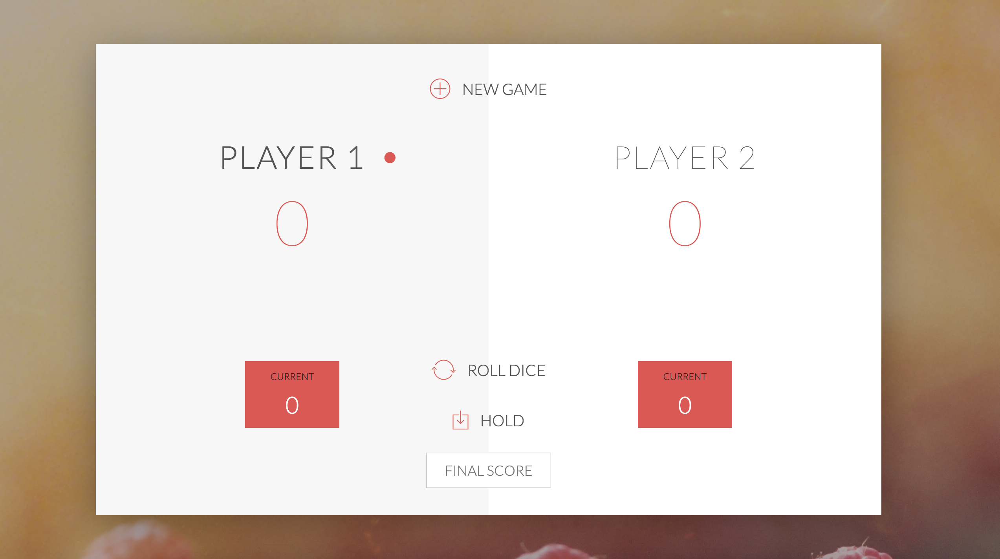
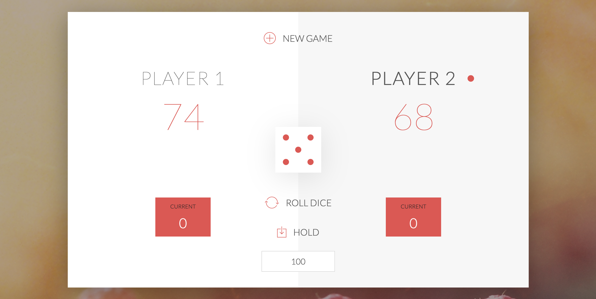
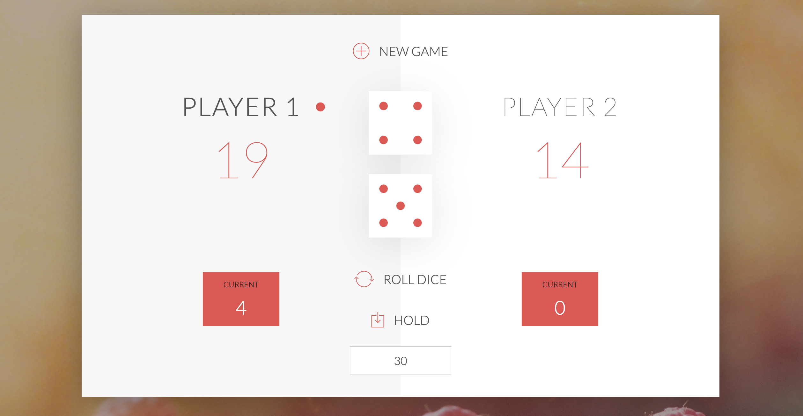

# PIG-GAME
A Simple Multiplayer PIG GAME designed using JavaScript and HTML

# GAME RULES:

- The game has 2 players, playing in rounds
- In each turn, a player rolls a dice as many times as he whishes. Each result get added to his ROUND score
- BUT, if the player rolls a 1, all his ROUND score gets lost. After that, it's the next player's turn
- The player can choose to 'Hold', which means that his ROUND score gets added to his GLBAL score. After that, it's the next player's turn
- The first player to reach 100 points on GLOBAL score wins the game

# Technology Stack
- Modular JavaScript
- HMTL5,CSS3

# Implemented

1. A player looses his ENTIRE score when he rolls two 6 in a row. After that, it's the next player's turn. 
2. Add an input field to the HTML where players can set the winning score, so that they can change the predefined score of 100.
3. In Two Dice game. The player looses his current score when one of them is a 1. 
4. You can change winning score while players are playing game
4. After Cliking On New Game button new game will start resetting the scores to zero.

# Game Screenshots

